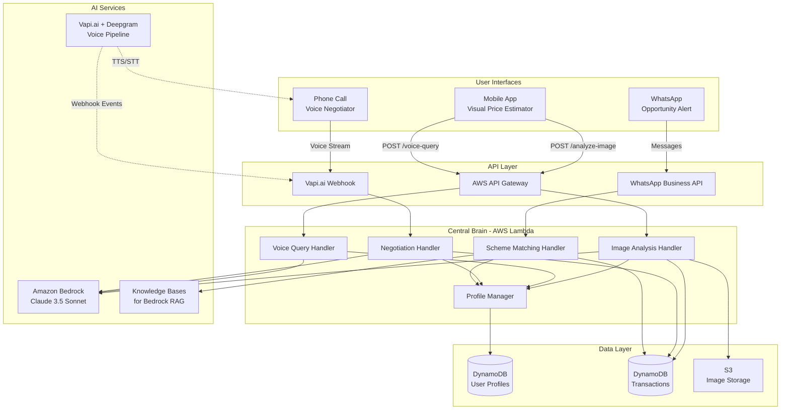
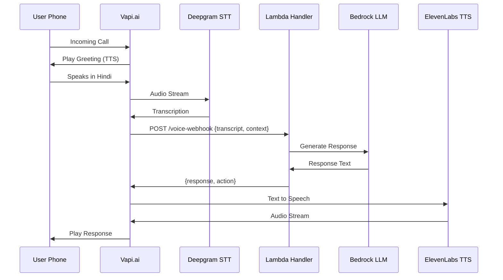
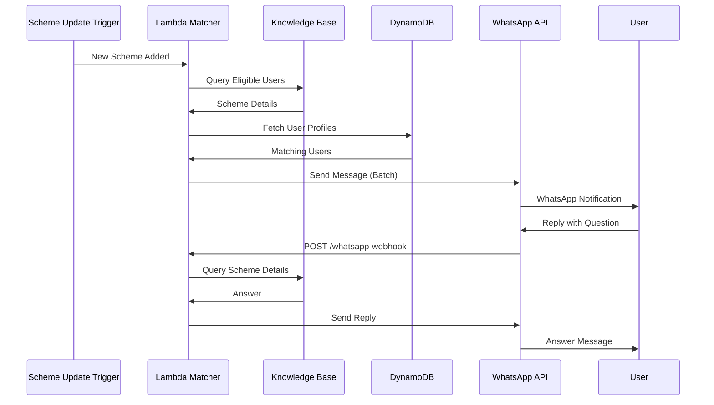

# Design Document: Pragati Connect

## Overview

Pragati Connect is a unified economic assistant architected around a "Central Brain" pattern—a single backend orchestration layer that serves three distinct user interfaces optimized for different access patterns and literacy levels. This design prioritizes hackathon feasibility while maintaining production-grade architectural principles.

### Design Philosophy

1. **Voice-First for Inclusion:** All critical functionality accessible via voice to serve low-literacy users—phone call and WhatsApp interfaces are primary, mobile app is secondary
2. **Interface Diversity, Backend Unity:** Three interfaces (phone call, WhatsApp, mobile app) share a common backend to ensure consistent business logic and data management
3. **Serverless for Speed:** AWS Lambda + API Gateway enables rapid deployment without infrastructure management
4. **AI as Intelligence Layer:** Amazon Bedrock provides both reasoning (text LLM) and knowledge retrieval (RAG) capabilities, with vision for future enhancement
5. **Graceful Degradation:** System remains functional under poor network conditions through compression, caching, and fallbacks

### Implementation Priority

**P0 (Core MVP):**
1. Voice Negotiator (Phone Call Interface) - Primary feature
2. Opportunity Alert (WhatsApp Interface) - Primary feature
3. Central Brain backend with user profile management
4. Knowledge Base for government schemes

**P1 (Future Enhancement):**
1. Visual Price Estimator (Mobile App Interface) - Secondary feature
2. Advanced negotiation scenarios
3. Analytics and monitoring dashboard

### High-Level Architecture



### Technology Stack Rationale

| Component | Technology | Justification |
|-----------|-----------|---------------|
| **Backend Framework** | Python + FastAPI | Rapid development, excellent async support, native AWS Lambda integration |
| **Text LLM** | Amazon Bedrock (Claude 3.5 Sonnet) | Best-in-class reasoning, AWS-native (low latency), enterprise security, no API key management |
| **Multimodal LLM** | Amazon Bedrock (Claude 3.5 Sonnet) | P1 future enhancement for image analysis, same model for consistency |
| **Knowledge Base** | Knowledge Bases for Bedrock | Managed RAG solution, automatic embeddings, semantic search optimized for Q&A |
| **Voice Infrastructure** | Vapi.ai + Deepgram + ElevenLabs | Sub-2s latency, production-ready phone integration, multilingual TTS/STT |
| **Database** | DynamoDB | Serverless, single-digit ms latency, auto-scaling, pay-per-request pricing ideal for hackathon |
| **Storage** | S3 | Durable image storage (P1), lifecycle policies for cost optimization |
| **Compute** | AWS Lambda | Zero infrastructure management, auto-scaling, pay-per-invocation (cost-effective for demo) |
| **API Gateway** | AWS API Gateway | RESTful endpoints, request validation, throttling, webhook support |

**Why Not Alternatives:**
- **OpenAI GPT-4V:** Requires API key management, higher latency from India, no AWS-native integration
- **Self-hosted LLMs:** Infeasible for 24-hour hackathon, requires GPU infrastructure
- **Traditional RDBMS:** Over-engineered for MVP, requires server management
- **Custom Voice Pipeline:** Building STT/TTS from scratch would consume entire hackathon timeline

**MVP Prioritization:**
- Focus on voice and WhatsApp interfaces first (P0)
- Image analysis is P1 future enhancement—backend API can be implemented but mobile UI deferred

## Architecture

### System Components

#### 1. Voice Negotiator (Phone Interface) - **P0 Priority**

**Technology:** Vapi.ai platform  
**Phone Number:** Vapi-provided toll-free number or local number

**Architecture Flow:**


**Core Responsibilities:**
- Real-time speech-to-text transcription
- Intent classification (wage query, negotiation practice, scheme question)
- Context management across conversation turns
- Text-to-speech synthesis in user's language
- Call state management (greeting, active, closing)

**Key Design Decisions:**
- **Latency Optimization:** Vapi handles audio streaming; Lambda only processes text (reduces round-trip time)
- **Context Window:** Store last 5 conversation turns in DynamoDB with 5-minute TTL
- **Fallback Handling:** If Bedrock times out, return pre-scripted response and log error
- **Language Detection:** Vapi detects language from first utterance, passes to Lambda for LLM prompt engineering

#### 2. Opportunity Alert (WhatsApp Interface) - **P0 Priority**

**Technology:** WhatsApp Business API (via Twilio or direct Meta integration)  
**Deployment:** Webhook endpoint on Lambda

**Architecture Flow:**


**Core Responsibilities:**
- Periodic scheme matching (daily cron job)
- Message templating with personalization
- Conversational Q&A about schemes
- Opt-in/opt-out management
- Rate limiting (2 messages/week per user)

**Key Design Decisions:**
- **Push vs Pull:** Proactive notifications (push) for new schemes, reactive Q&A (pull) for details
- **Batching:** Process notifications in batches of 100 to avoid API rate limits
- **Template Approval:** WhatsApp requires pre-approved message templates; design 3-5 templates for common scenarios
- **Conversation State:** Stateless Q&A (each message is independent) to simplify implementation

#### 3. Mobile App (Visual Price Estimator) - **P1 Priority (Future Enhancement)**

**Technology:** React Native (cross-platform) or Flutter  
**Deployment:** API-first design allows future app development

**Core Responsibilities:**
- Image capture and compression
- API communication with Central Brain
- Voice input/output via device microphone
- Local caching of price estimates
- Language selection and profile management

**Key Design Decisions:**
- **Image Compression:** Client-side compression to 500KB using browser/native APIs before upload
- **Progressive Loading:** Show low-res image preview immediately, full analysis results stream in
- **Offline-First Cache:** IndexedDB (web) or SQLite (native) stores last 10 estimates
- **Voice Integration:** Web Speech API (web) or native speech recognition, fallback to Deepgram API
- **MVP Scope:** Focus on backend API implementation; mobile UI can be minimal or developed in later phase

### Central Brain (Backend Orchestration)

**Implementation:** AWS Lambda functions written in Python with FastAPI framework (using Mangum adapter)

**Lambda Functions:**

| Function Name | Trigger | Purpose | Priority | Timeout |
|---------------|---------|---------|----------|---------|
| `voice-webhook` | Vapi webhook | Process voice call interactions, manage conversation | P0 | 10s |
| `whatsapp-webhook` | WhatsApp API | Handle incoming WhatsApp messages | P0 | 10s |
| `scheme-matcher` | EventBridge (daily) | Match users to new schemes, send notifications | P0 | 60s |
| `profile-manager` | API Gateway POST/GET | CRUD operations on user profiles | P0 | 5s |
| `analyze-image` | API Gateway POST | Process image, call Bedrock vision, return price estimate | P1 | 30s |
| `voice-query` | API Gateway POST | Handle voice questions about price estimates | P1 | 10s |

**Shared Logic (Python Modules):**
- `bedrock_client.py`: Wrapper for Bedrock API calls with retry logic
- `knowledge_base.py`: RAG query interface for scheme retrieval
- `profile_service.py`: DynamoDB operations for user profiles
- `language_utils.py`: Translation and language detection utilities
- `voice_handler.py`: Business logic for wage queries and negotiation practice
- `price_estimator.py`: Business logic for price calculation (P1 - future enhancement)

### Data Flow Examples

#### Example 1: Voice Negotiation Flow (P0 - Core Feature)

#### Example 1: Voice Negotiation Flow (P0 - Core Feature)

1. User calls Vapi number, selects Hindi
2. Vapi greets: "Namaste! Main Pragati Connect hoon. Aap kis kaam mein hain?" (What work do you do?)
3. User: "Main carpenter hoon, furniture banata hoon" (I'm a carpenter, I make furniture)
4. Vapi transcribes, sends to Lambda webhook: `{transcript: "Main carpenter hoon...", user_phone: "+91..."}`
5. Lambda:
   - Looks up user profile by phone (if exists) or creates new profile
   - Calls Bedrock: "User is a carpenter in [location]. Provide typical daily wage range and key factors affecting pricing."
   - Bedrock: "Carpenters in rural UP: ₹500-₹800/day. Factors: experience, tool ownership, work complexity."
   - Returns to Vapi: `{response: "Aapke area mein carpenter ki daily wage ₹500 se ₹800 hai...", action: "continue"}`
6. Vapi synthesizes Hindi speech, plays to user
7. Conversation continues with negotiation practice simulation

#### Example 2: WhatsApp Scheme Notification Flow (P0 - Core Feature)

1. Daily cron job triggers `scheme-matcher` Lambda
2. Lambda queries Knowledge Base for schemes added in last 24 hours
3. For new "Vishwakarma Scheme" for artisans:
   - Queries DynamoDB for users with trade="carpenter" or "weaver" or "potter"
   - Finds 50 matching users with WhatsApp opt-in
4. For each user, generates personalized message:
   ```
   Namaste Raju ji! 
   
   Aapke liye ek nayi scheme hai:
   
   📋 Vishwakarma Scheme
   💰 Labh: ₹10,000 training + ₹1,00,000 loan
   ✅ Eligibility: Traditional artisans
   📅 Last Date: 31 March 2024
   
   Zyada jaankari ke liye reply karein.
   ```
5. Sends batch of messages via WhatsApp Business API
6. User replies: "Kaise apply karein?" (How to apply?)
7. WhatsApp webhook triggers Lambda
8. Lambda queries Knowledge Base with user's question
9. Returns application process steps in Hindi

#### Example 3: Image Analysis Flow (P1 - Future Enhancement)

1. User uploads saree photo via mobile app
2. App compresses image to 500KB, sends POST to `/api/v1/analyze-image` with user_id and language
3. API Gateway validates request, triggers `analyze-image` Lambda
4. Lambda:
   - Retrieves user profile from DynamoDB (trade: weaver, location: Tamil Nadu)
   - Uploads image to S3 with 30-day expiration
   - Calls Bedrock with prompt: "Analyze this handloom saree. Identify: weave type, thread count estimate, color complexity, condition. Return JSON."
   - Bedrock returns: `{weave: "Kanchipuram", thread_count: "high", colors: 5, condition: "excellent"}`
   - Applies pricing logic: Base price ₹1500 + (thread_count_high: +₹500) + (colors_5: +₹300) = ₹2300
   - Queries regional market data (mock for MVP): Kanchipuram sarees in TN: ₹2000-₹2800
   - Generates final estimate: ₹2200-₹2600
   - Stores transaction in DynamoDB
5. Lambda returns JSON: `{price_min: 2200, price_max: 2600, confidence: "high", factors: [...], explanation_text: "..."}`
6. App displays price, plays Tamil voice narration

## Components and Interfaces

### API Specification

#### Base URL
- **Production:** `https://api.pragaticonnect.in/v1` (hackathon: API Gateway URL)
- **Authentication:** API Key in header `X-API-Key` for mobile app; webhook signature verification for Vapi/WhatsApp

#### Endpoint: POST /api/v1/voice-webhook (P0 Priority)

#### Endpoint: POST /api/v1/voice-webhook (P0 Priority)

**Purpose:** Handle Vapi.ai voice call events

**Request (from Vapi):**
```json
{
  "event_type": "transcript|call_start|call_end",
  "call_id": "string",
  "user_phone": "string",
  "transcript": "string (user's speech)",
  "language": "string",
  "context": {
    "conversation_history": [...],
    "current_intent": "wage_query|negotiation_practice|scheme_question"
  }
}
```

**Response (200 OK):**
```json
{
  "response_text": "Aapke area mein carpenter ki daily wage...",
  "action": "continue|transfer|end_call",
  "context_update": {
    "user_trade": "carpenter",
    "location": "rural_up"
  }
}
```

#### Endpoint: POST /api/v1/whatsapp-webhook (P0 Priority)

**Purpose:** Handle incoming WhatsApp messages

**Request (from WhatsApp API):**
```json
{
  "from": "+91XXXXXXXXXX",
  "message": "string",
  "message_type": "text|image",
  "timestamp": "string"
}
```

**Response (200 OK):**
```json
{
  "reply": "string (message to send back)",
  "action": "send_message|mark_read|no_action"
}
```

#### Endpoint: POST /api/v1/users/profile (P0 Priority)

**Purpose:** Create or update user profile

**Request:**
```json
{
  "phone": "string (unique identifier)",
  "primary_trade": "string",
  "secondary_trades": ["string"],
  "location": {
    "state": "string",
    "district": "string"
  },
  "language": "string",
  "whatsapp_opt_in": boolean
}
```

**Response (200 OK):**
```json
{
  "user_id": "string (phone)",
  "profile": {...},
  "created_at": "timestamp",
  "updated_at": "timestamp"
}
```

#### Endpoint: GET /api/v1/users/profile/{phone} (P0 Priority)

**Purpose:** Retrieve user profile

**Response (200 OK):**
```json
{
  "user_id": "string",
  "profile": {...},
  "interaction_count": 42,
  "last_interaction": "timestamp"
}
```

#### Endpoint: POST /api/v1/analyze-image (P1 Priority - Future Enhancement)

**Purpose:** Analyze product image and return fair market price estimate

**Request:**
```json
{
  "user_id": "string (phone number)",
  "image": "string (base64 encoded) OR multipart/form-data",
  "language": "string (hi|ta|te|bn)",
  "product_category": "string (optional hint: saree|furniture|pottery)"
}
```

**Response (200 OK):**
```json
{
  "transaction_id": "uuid",
  "price_estimate": {
    "min": 2200,
    "max": 2600,
    "currency": "INR",
    "confidence": "high|medium|low"
  },
  "analysis": {
    "category": "handloom_saree",
    "materials": ["silk", "zari"],
    "complexity_score": 8,
    "condition": "excellent",
    "regional_context": "Kanchipuram style, Tamil Nadu"
  },
  "explanation": {
    "text": "This Kanchipuram saree shows high thread count and intricate zari work...",
    "voice_url": "https://s3.../explanation_ta.mp3",
    "factors": [
      {"factor": "Weave complexity", "impact": "+₹500"},
      {"factor": "Zari work", "impact": "+₹300"}
    ]
  },
  "timestamp": "2024-01-15T10:30:00Z"
}
```

**Error Responses:**
- `400 Bad Request`: Invalid image format or missing required fields
- `413 Payload Too Large`: Image exceeds 5MB
- `422 Unprocessable Entity`: Image quality insufficient for analysis
- `500 Internal Server Error`: Bedrock API failure
- `503 Service Unavailable`: Rate limit exceeded

### External Service Integrations```

**Response (200 OK):**
```json
{
  "answer": {
    "text": "The price is higher because of the intricate zari work...",
    "voice_url": "https://s3.../answer_ta.mp3"
  },
  "follow_up_suggestions": [
    "How do I negotiate this price?",
    "What if the buyer offers less?"
  ]
}
```

#### Endpoint: POST /api/v1/voice-webhook

**Purpose:** Handle Vapi.ai voice call events

**Request (from Vapi):**
```json
{
  "event_type": "transcript|call_start|call_end",
  "call_id": "string",
  "user_phone": "string",
  "transcript": "string (user's speech)",
  "language": "string",
  "context": {
    "conversation_history": [...],
    "current_intent": "wage_query|negotiation_practice|scheme_question"
  }
}
```

**Response (200 OK):**
```json
{
  "response_text": "Aapke area mein carpenter ki daily wage...",
  "action": "continue|transfer|end_call",
  "context_update": {
    "user_trade": "carpenter",
    "location": "rural_up"
  }
}
```

#### Endpoint: POST /api/v1/whatsapp-webhook

**Purpose:** Handle incoming WhatsApp messages

**Request (from WhatsApp API):**
```json
{
  "from": "+91XXXXXXXXXX",
  "message": "string",
  "message_type": "text|image",
  "timestamp": "string"
}
```

**Response (200 OK):**
```json
{
  "reply": "string (message to send back)",
  "action": "send_message|mark_read|no_action"
}
```

#### Endpoint: POST /api/v1/users/profile

**Purpose:** Create or update user profile

**Request:**
```json
{
  "phone": "string (unique identifier)",
  "primary_trade": "string",
  "secondary_trades": ["string"],
  "location": {
    "state": "string",
    "district": "string"
  },
  "language": "string",
  "whatsapp_opt_in": boolean
}
```

**Response (200 OK):**
```json
{
  "user_id": "string (phone)",
  "profile": {...},
  "created_at": "timestamp",
  "updated_at": "timestamp"
}
```

#### Endpoint: GET /api/v1/users/profile/{phone}

**Purpose:** Retrieve user profile

**Response (200 OK):**
```json
{
  "user_id": "string",
  "profile": {...},
  "interaction_count": 42,
  "last_interaction": "timestamp"
}
```

### External Service Integrations

#### Amazon Bedrock Integration

**Model:** `anthropic.claude-3-5-sonnet-20241022-v2:0`

**Image Analysis Prompt Template:**
```python
prompt = f"""Analyze this product image for price estimation.

Product Context:
- User Trade: {user_trade}
- Location: {user_location}
- Category Hint: {category_hint if provided else "unknown"}

Please identify:
1. Product category and type
2. Materials used (be specific)
3. Craftsmanship complexity (scale 1-10, where 10 is master-level)
4. Condition (excellent/good/fair/poor)
5. Unique features or regional style markers

Return your analysis in this JSON format:
{{
  "category": "string",
  "materials": ["string"],
  "complexity_score": number,
  "condition": "string",
  "unique_features": ["string"],
  "regional_style": "string"
}}

Be precise and focus on factors that affect market value.
"""
```

**API Call:**
```python
import boto3
import json

bedrock = boto3.client('bedrock-runtime', region_name='ap-south-1')

def analyze_image(image_bytes, prompt):
    response = bedrock.invoke_model(
        modelId='anthropic.claude-3-5-sonnet-20241022-v2:0',
        contentType='application/json',
        accept='application/json',
        body=json.dumps({
            "anthropic_version": "bedrock-2023-05-31",
            "max_tokens": 1024,
            "messages": [
                {
                    "role": "user",
                    "content": [
                        {
                            "type": "image",
                            "source": {
                                "type": "base64",
                                "media_type": "image/jpeg",
                                "data": image_bytes
                            }
                        },
                        {
                            "type": "text",
                            "text": prompt
                        }
                    ]
                }
            ]
        })
    )
    
    result = json.loads(response['body'].read())
    return json.loads(result['content'][0]['text'])
```

#### Knowledge Bases for Bedrock (RAG)

**Setup:**
1. Create S3 bucket with government scheme documents (PDFs, text files)
2. Create Knowledge Base in Bedrock console
3. Configure data source: S3 bucket with scheme documents
4. Bedrock automatically chunks documents and creates embeddings

**Query API:**
```python
def query_schemes(user_query, user_profile):
    bedrock_agent = boto3.client('bedrock-agent-runtime', region_name='ap-south-1')
    
    # Add user context to query for better retrieval
    contextualized_query = f"""
    User Profile: {user_profile['primary_trade']}, {user_profile['location']['state']}
    Question: {user_query}
    """
    
    response = bedrock_agent.retrieve_and_generate(
        input={'text': contextualized_query},
        retrieveAndGenerateConfiguration={
            'type': 'KNOWLEDGE_BASE',
            'knowledgeBaseConfiguration': {
                'knowledgeBaseId': 'KB_ID_HERE',
                'modelArn': 'arn:aws:bedrock:ap-south-1::foundation-model/anthropic.claude-3-5-sonnet-20241022-v2:0'
            }
        }
    )
    
    return response['output']['text']
```

#### Vapi.ai Integration

**Configuration:**
```json
{
  "name": "Pragati Connect Voice Assistant",
  "model": {
    "provider": "custom-llm",
    "url": "https://api.pragaticonnect.in/v1/voice-webhook",
    "model": "gpt-4"
  },
  "voice": {
    "provider": "11labs",
    "voiceId": "hindi_female_voice_id"
  },
  "transcriber": {
    "provider": "deepgram",
    "model": "nova-2",
    "language": "hi"
  },
  "firstMessage": "Namaste! Main Pragati Connect hoon. Main aapki madad kar sakti hoon wage negotiation aur government schemes ke baare mein. Aap kis kaam mein hain?",
  "endCallFunctionEnabled": true
}
```

**Webhook Handler Logic:**
```python
@app.post("/api/v1/voice-webhook")
async def handle_vapi_webhook(request: VapiWebhookRequest):
    user_phone = request.user_phone
    transcript = request.transcript
    context = request.context
    
    # Retrieve or create user profile
    profile = get_user_profile(user_phone)
    
    # Classify intent
    intent = classify_intent(transcript, context)
    
    if intent == "wage_query":
        response = handle_wage_query(transcript, profile)
    elif intent == "negotiation_practice":
        response = handle_negotiation_practice(transcript, profile, context)
    elif intent == "scheme_question":
        response = query_schemes(transcript, profile)
    else:
        response = "Maaf kijiye, main samjha nahi. Kya aap phir se keh sakte hain?"
    
    # Update conversation context
    update_context(user_phone, transcript, response)
    
    return {
        "response_text": response,
        "action": "continue"
    }
```

## Data Models

### DynamoDB Tables

#### Table: UserProfiles

**Partition Key:** `phone` (String)  
**Attributes:**

| Attribute | Type | Description | Example |
|-----------|------|-------------|---------|
| phone | String | User's phone number (PK) | "+919876543210" |
| primary_trade | String | Main occupation | "weaver" |
| secondary_trades | List | Additional skills | ["embroidery", "dyeing"] |
| location_state | String | State | "Tamil Nadu" |
| location_district | String | District | "Kanchipuram" |
| language | String | Preferred language code | "ta" |
| whatsapp_opt_in | Boolean | Consent for WhatsApp messages | true |
| created_at | String | ISO timestamp | "2024-01-15T10:00:00Z" |
| updated_at | String | ISO timestamp | "2024-01-20T15:30:00Z" |
| interaction_count | Number | Total interactions | 15 |
| last_interaction | String | Last activity timestamp | "2024-01-20T15:30:00Z" |

**GSI: LocationTradeIndex**
- Partition Key: `location_state`
- Sort Key: `primary_trade`
- Purpose: Query users by location and trade for scheme matching

#### Table: Transactions

**Partition Key:** `transaction_id` (String)  
**Sort Key:** `timestamp` (String)  
**Attributes:**

| Attribute | Type | Description | Example |
|-----------|------|-------------|---------|
| transaction_id | String | UUID (PK) | "550e8400-e29b-41d4-a716-446655440000" |
| user_phone | String | User identifier | "+919876543210" |
| transaction_type | String | Type of interaction | "image_analysis" |
| timestamp | String | ISO timestamp (SK) | "2024-01-15T10:30:00Z" |
| image_s3_key | String | S3 object key (if applicable) | "images/2024/01/15/uuid.jpg" |
| analysis_result | Map | Bedrock analysis output | {...} |
| price_estimate | Map | Price range and factors | {min: 2200, max: 2600} |
| language | String | Language used | "ta" |
| latency_ms | Number | Processing time | 6500 |

**GSI: UserTransactionsIndex**
- Partition Key: `user_phone`
- Sort Key: `timestamp`
- Purpose: Retrieve user's transaction history

#### Table: ConversationContext

**Partition Key:** `session_id` (String)  
**TTL:** `expiration_time` (Number, 5 minutes)  
**Attributes:**

| Attribute | Type | Description | Example |
|-----------|------|-------------|---------|
| session_id | String | Call ID or chat session (PK) | "vapi_call_12345" |
| user_phone | String | User identifier | "+919876543210" |
| conversation_history | List | Last 5 turns | [{role: "user", text: "..."}, ...] |
| current_intent | String | Detected intent | "negotiation_practice" |
| context_data | Map | Session-specific data | {trade: "carpenter", scenario: "aggressive"} |
| expiration_time | Number | Unix timestamp for TTL | 1705320600 |

### S3 Bucket Structure

**Bucket Name:** `pragati-connect-images-{env}`

**Structure:**
```
/images/
  /2024/
    /01/
      /15/
        /550e8400-e29b-41d4-a716-446655440000.jpg
        /550e8400-e29b-41d4-a716-446655440001.jpg
/voice-outputs/
  /2024/
    /01/
      /15/
        /explanation_ta_550e8400.mp3
```

**Lifecycle Policy:**
- Images: Delete after 30 days
- Voice outputs: Delete after 7 days

**Encryption:** Server-side encryption with AWS KMS

### Data Schemas (Python Pydantic Models)

```python
from pydantic import BaseModel, Field
from typing import List, Optional
from datetime import datetime

class UserProfile(BaseModel):
    phone: str = Field(..., regex=r'^\+91\d{10}$')
    primary_trade: str
    secondary_trades: List[str] = []
    location_state: str
    location_district: str
    language: str = Field(..., regex=r'^(hi|ta|te|bn)$')
    whatsapp_opt_in: bool = False
    created_at: datetime
    updated_at: datetime
    interaction_count: int = 0
    last_interaction: Optional[datetime] = None

class PriceEstimate(BaseModel):
    min: int
    max: int
    currency: str = "INR"
    confidence: str = Field(..., regex=r'^(high|medium|low)$')

class ImageAnalysis(BaseModel):
    category: str
    materials: List[str]
    complexity_score: int = Field(..., ge=1, le=10)
    condition: str
    unique_features: List[str] = []
    regional_style: Optional[str] = None

class Transaction(BaseModel):
    transaction_id: str
    user_phone: str
    transaction_type: str
    timestamp: datetime
    image_s3_key: Optional[str] = None
    analysis_result: Optional[ImageAnalysis] = None
    price_estimate: Optional[PriceEstimate] = None
    language: str
    latency_ms: int

class ConversationTurn(BaseModel):
    role: str = Field(..., regex=r'^(user|assistant)$')
    text: str
    timestamp: datetime

class ConversationContext(BaseModel):
    session_id: str
    user_phone: str
    conversation_history: List[ConversationTurn] = Field(..., max_items=5)
    current_intent: str
    context_data: dict = {}
    expiration_time: int
```

## Correctness Properties

*A property is a characteristic or behavior that should hold true across all valid executions of a system—essentially, a formal statement about what the system should do. Properties serve as the bridge between human-readable specifications and machine-verifiable correctness guarantees.*


### Property 1: Image Upload Validation
*For any* file upload request, the system should accept JPEG/PNG formats up to 5MB and reject all other formats or sizes with appropriate error messages.
**Validates: Requirements 1.1**

### Property 2: Response Latency Bounds
*For any* user request (image analysis, voice query, or webhook), the system should complete processing and return a response within the specified time limit for that operation type (8s for image analysis, 2s for voice, 1.5s for webhooks).
**Validates: Requirements 1.3, 4.1, 8.3, 14.3**

### Property 3: Language Consistency
*For any* user with a language preference set in their profile, all responses (text, voice URLs, and TTS) should be in that language across all three interfaces.
**Validates: Requirements 1.4, 11.2, 11.3, 11.4**

### Property 4: Multi-Language Support
*For any* supported language (Hindi, Tamil, Telugu, Bengali), the system should correctly process voice input, generate responses, and synthesize speech in that language.
**Validates: Requirements 2.2, 11.1**

### Property 5: Conversation Context Preservation
*For any* conversation session, follow-up questions asked within 5 minutes should have access to the previous conversation context and generate contextually relevant responses.
**Validates: Requirements 2.5, 14.4**

### Property 6: Wage Query Accuracy
*For any* valid trade and location combination, the voice negotiator should return a wage range that is non-empty and contains positive rupee values.
**Validates: Requirements 3.3**

### Property 7: Negotiation Simulation Consistency
*For any* negotiation practice session with a selected scenario type, all system responses should match the personality characteristics of that scenario (aggressive, polite, or corporate).
**Validates: Requirements 3.4, 17.2**

### Property 8: Network Interruption Recovery
*For any* voice conversation that experiences a network interruption lasting less than 30 seconds, the system should restore the conversation context when connection resumes.
**Validates: Requirements 4.5**

### Property 9: User Profile Lifecycle
*For any* new user interacting via any interface, the system should create a profile with all required fields (phone, trade, location, language, timestamp), and subsequent accesses should retrieve this same profile.
**Validates: Requirements 7.1, 7.2, 7.3**

### Property 10: Cross-Interface Data Consistency
*For any* user profile update made via one interface, the changes should be immediately visible when accessing the system via any other interface.
**Validates: Requirements 7.4**

### Property 11: WhatsApp Opt-In Storage
*For any* user registration, if WhatsApp opt-in is provided, the phone number and consent flag should be stored in the user profile and persist across sessions.
**Validates: Requirements 5.1**

### Property 12: Scheme Notification Timing
*For any* new government scheme added to the knowledge base that matches a user's profile, a notification should be sent to that user within 24 hours.
**Validates: Requirements 5.2**

### Property 13: Notification Content Completeness
*For any* scheme notification sent via WhatsApp, the message should contain all required fields: scheme name, benefit amount, eligibility criteria, and application deadline.
**Validates: Requirements 5.3, 9.2**

### Property 14: Notification Rate Limiting
*For any* user with WhatsApp opt-in, the system should send no more than 2 notifications within any 7-day rolling window.
**Validates: Requirements 5.5**

### Property 15: Scheme Matching Accuracy
*For any* user profile with specified trade and location, the scheme matching algorithm should return only schemes where the user meets the eligibility criteria.
**Validates: Requirements 6.1, 6.2**

### Property 16: Scheme Ranking Order
*For any* set of matched schemes for a user, the results should be ordered by benefit value (descending) and then by deadline urgency (ascending).
**Validates: Requirements 6.3**

### Property 17: Profile Update Re-Evaluation
*For any* user profile update that changes trade or location, the system should re-run scheme matching and notify the user of any newly matched schemes.
**Validates: Requirements 6.4**

### Property 18: LLM Prompt Structure
*For any* image analysis request, the generated prompt should include requests for product category, materials, complexity score, and condition assessment.
**Validates: Requirements 8.2**

### Property 19: LLM Response Format
*For any* successful image analysis, the multimodal LLM should return a valid JSON object containing category, materials array, complexity_score (1-10), and condition fields.
**Validates: Requirements 8.3**

### Property 20: Knowledge Base Retrieval Relevance
*For any* scheme query, the knowledge base should return results ranked by semantic similarity, with the most relevant scheme appearing first.
**Validates: Requirements 9.3**

### Property 21: Scheme Expiration Handling
*For any* scheme with a deadline in the past, the system should mark it as inactive and exclude it from all query results and notifications.
**Validates: Requirements 9.5**

### Property 22: Image Compression
*For any* uploaded image, the system should compress it to a maximum of 500KB before transmission while maintaining sufficient quality for analysis.
**Validates: Requirements 10.1**

### Property 23: Offline Cache Size Limit
*For any* mobile app instance, the local cache should store exactly the last 10 price estimates (or fewer if less than 10 have been generated) and not exceed 50MB total storage.
**Validates: Requirements 10.3, 18.1, 18.5**

### Property 24: S3 Encryption and Expiration
*For any* image stored in S3, the object should have server-side encryption enabled and a lifecycle policy set to delete after 30 days.
**Validates: Requirements 12.4**

### Property 25: Data Deletion Command
*For any* user who sends the WhatsApp command "/delete-my-data", all associated user profile data, transaction history, and stored images should be permanently deleted within 24 hours.
**Validates: Requirements 12.5**

### Property 26: Request Routing
*For any* incoming API request, the system should route it to the correct Lambda handler based on the endpoint path and interface type.
**Validates: Requirements 13.3**

### Property 27: Authentication Validation
*For any* API request without valid authentication (missing API key or invalid webhook signature), the system should reject the request with a 401 Unauthorized response.
**Validates: Requirements 13.4**

### Property 28: Comprehensive Logging
*For any* API request, image analysis, or error occurrence, the system should create a log entry in CloudWatch with timestamp, operation type, and severity level.
**Validates: Requirements 8.5, 13.5, 15.5**

### Property 29: Intent Classification
*For any* voice transcription received from Vapi, the system should classify it into one of the defined intent categories (wage_query, negotiation_practice, scheme_question, or unknown).
**Validates: Requirements 14.2**

### Property 30: Webhook Idempotency
*For any* Vapi webhook request sent multiple times with the same call_id and transcript, the system should return identical responses.
**Validates: Requirements 14.5**

### Property 31: LLM Failure Handling
*For any* image analysis where the multimodal LLM fails or times out, the system should return a user-friendly error message suggesting to retake the photo, rather than exposing technical errors.
**Validates: Requirements 15.1**

### Property 32: Low Confidence Transcription Handling
*For any* voice transcription with confidence score below 70%, the system should request the user to repeat their question rather than processing potentially incorrect input.
**Validates: Requirements 15.2**

### Property 33: Knowledge Base Empty Results Fallback
*For any* knowledge base query that returns zero results, the system should provide a fallback response offering alternative assistance.
**Validates: Requirements 15.3**

### Property 34: Timeout Handling
*For any* operation that exceeds 10 seconds, the system should timeout gracefully and return an error response instructing the user to retry.
**Validates: Requirements 15.4**

### Property 35: Analytics Event Tracking
*For any* user interaction (image analysis, voice call, WhatsApp message), the system should record the event in analytics with user_id, timestamp, operation type, and success/failure status.
**Validates: Requirements 16.1, 16.2, 16.3, 16.4**

### Property 36: Negotiation Scenario Availability
*For any* negotiation practice request, the system should offer all three scenario types (aggressive bargainer, polite client, corporate buyer) as options.
**Validates: Requirements 17.1**

### Property 37: Practice Session Feedback
*For any* negotiation practice session, the system should provide at least one piece of real-time feedback during the conversation and a summary at the end.
**Validates: Requirements 17.3, 17.4**

### Property 38: Practice History Storage
*For any* completed negotiation practice session, the system should store a record in the user's profile including scenario type, duration, and feedback summary.
**Validates: Requirements 17.5**

### Property 39: Offline Cache Display
*For any* cached price estimate, when the app is offline, the estimate should be displayed with a "Last updated" timestamp indicating when it was originally generated.
**Validates: Requirements 18.2**

### Property 40: Favorites Persistence
*For any* price estimate marked as a favorite by the user, it should remain in the cache permanently (not subject to the 10-estimate limit) until explicitly removed.
**Validates: Requirements 18.4**


## Error Handling

### Error Categories and Responses

#### 1. Input Validation Errors (4xx)

**Scenario:** Invalid image format, missing required fields, malformed requests

**Handling Strategy:**
- Return HTTP 400 Bad Request with descriptive error message
- Include field-specific errors in response body
- Log validation failures for monitoring

**Example Response:**
```json
{
  "error": "INVALID_IMAGE_FORMAT",
  "message": "Only JPEG and PNG formats are supported",
  "details": {
    "received_format": "gif",
    "supported_formats": ["jpeg", "png"]
  },
  "user_message_hi": "Kripya JPEG ya PNG format mein photo upload karein"
}
```

#### 2. Authentication Errors (401/403)

**Scenario:** Missing API key, invalid webhook signature, expired tokens

**Handling Strategy:**
- Return HTTP 401 Unauthorized for missing/invalid credentials
- Return HTTP 403 Forbidden for valid credentials but insufficient permissions
- Do not expose authentication mechanism details in error messages
- Log authentication failures with IP address for security monitoring

#### 3. Resource Not Found Errors (404)

**Scenario:** User profile doesn't exist, transaction ID not found, scheme not in knowledge base

**Handling Strategy:**
- Return HTTP 404 Not Found with generic message
- For user-facing errors, suggest corrective actions
- Avoid exposing internal resource identifiers

**Example Response:**
```json
{
  "error": "PROFILE_NOT_FOUND",
  "message": "User profile not found. Please register first.",
  "action": "register",
  "user_message_hi": "Pehle registration karein"
}
```

#### 4. External Service Failures (502/503)

**Scenario:** Bedrock API timeout, Vapi.ai unavailable, DynamoDB throttling, S3 upload failure

**Handling Strategy:**
- Implement exponential backoff retry (3 attempts with 1s, 2s, 4s delays)
- Return HTTP 503 Service Unavailable if all retries fail
- Provide user-friendly fallback responses
- Alert on-call engineer if failure rate exceeds 5%

**Bedrock Timeout Handling:**
```python
async def analyze_image_with_retry(image_bytes, prompt, max_retries=3):
    for attempt in range(max_retries):
        try:
            response = await bedrock_client.invoke_model(...)
            return response
        except TimeoutError:
            if attempt == max_retries - 1:
                logger.error(f"Bedrock timeout after {max_retries} attempts")
                return {
                    "error": "ANALYSIS_TIMEOUT",
                    "message": "Image analysis is taking longer than expected. Please try again.",
                    "user_message_hi": "Kripya thodi der baad phir se try karein"
                }
            await asyncio.sleep(2 ** attempt)
```

#### 5. Rate Limiting (429)

**Scenario:** User exceeds API rate limits, WhatsApp notification quota exceeded

**Handling Strategy:**
- Return HTTP 429 Too Many Requests with Retry-After header
- Implement token bucket algorithm (100 requests per user per hour)
- For WhatsApp, enforce 2 messages/week limit at application level

**Example Response:**
```json
{
  "error": "RATE_LIMIT_EXCEEDED",
  "message": "Too many requests. Please try again in 30 minutes.",
  "retry_after_seconds": 1800,
  "user_message_hi": "Bahut zyada requests. 30 minute baad try karein"
}
```

#### 6. Business Logic Errors (422)

**Scenario:** Image quality too low for analysis, unsupported language detected, ambiguous materials

**Handling Strategy:**
- Return HTTP 422 Unprocessable Entity
- Provide specific guidance on how to resolve the issue
- Use voice guidance for low-literacy users

**Low Image Quality Response:**
```json
{
  "error": "INSUFFICIENT_IMAGE_QUALITY",
  "message": "Image quality is too low for accurate analysis",
  "suggestions": [
    "Take photo in better lighting",
    "Move closer to the product",
    "Clean camera lens"
  ],
  "voice_guidance_url": "https://s3.../guidance_hi.mp3",
  "user_message_hi": "Photo ki quality kam hai. Achhi roshni mein photo lein"
}
```

### Error Recovery Patterns

#### Pattern 1: Graceful Degradation

When non-critical features fail, continue with core functionality:

- If TTS fails, return text-only response
- If voice narration generation fails, provide text explanation
- If regional market data unavailable, use national averages with disclaimer

#### Pattern 2: Circuit Breaker

Prevent cascading failures from external services:

```python
class CircuitBreaker:
    def __init__(self, failure_threshold=5, timeout=60):
        self.failure_count = 0
        self.failure_threshold = failure_threshold
        self.timeout = timeout
        self.last_failure_time = None
        self.state = "CLOSED"  # CLOSED, OPEN, HALF_OPEN
    
    async def call(self, func, *args, **kwargs):
        if self.state == "OPEN":
            if time.time() - self.last_failure_time > self.timeout:
                self.state = "HALF_OPEN"
            else:
                raise ServiceUnavailableError("Circuit breaker is OPEN")
        
        try:
            result = await func(*args, **kwargs)
            if self.state == "HALF_OPEN":
                self.state = "CLOSED"
                self.failure_count = 0
            return result
        except Exception as e:
            self.failure_count += 1
            self.last_failure_time = time.time()
            if self.failure_count >= self.failure_threshold:
                self.state = "OPEN"
            raise e
```

#### Pattern 3: Fallback Responses

Maintain pre-generated fallback responses for common scenarios:

```python
FALLBACK_RESPONSES = {
    "wage_query_carpenter": {
        "hi": "Carpenter ki average daily wage ₹500 se ₹800 hoti hai. Aapke experience aur location ke hisaab se ye badal sakti hai.",
        "ta": "தச்சர் சராசரி தினசரி ஊதியம் ₹500 முதல் ₹800 வரை உள்ளது."
    },
    "scheme_query_timeout": {
        "hi": "Scheme ki jaankari abhi available nahi hai. Kripya thodi der baad try karein.",
        "ta": "திட்ட தகவல் தற்போது கிடைக்கவில்லை. சிறிது நேரம் கழித்து முயற்சிக்கவும்."
    }
}
```

### Monitoring and Alerting

**CloudWatch Metrics:**
- Error rate by error type (target: <2% for 4xx, <0.5% for 5xx)
- Bedrock API latency and timeout rate
- DynamoDB throttling events
- S3 upload failure rate

**Alerts:**
- Critical: 5xx error rate >1% for 5 minutes → Page on-call engineer
- Warning: Bedrock timeout rate >5% for 10 minutes → Slack notification
- Info: Daily summary of error distribution → Email to team

## Testing Strategy

### Dual Testing Approach

Pragati Connect requires both unit tests and property-based tests to ensure comprehensive coverage:

- **Unit Tests:** Validate specific examples, edge cases, integration points, and error conditions
- **Property-Based Tests:** Verify universal properties hold across all possible inputs through randomized testing

Both testing approaches are complementary and necessary. Unit tests catch concrete bugs in specific scenarios, while property tests verify general correctness across the input space.

### Property-Based Testing Framework

**Technology:** Hypothesis (Python)

**Configuration:**
- Minimum 100 iterations per property test (due to randomization)
- Each test tagged with feature name and property number
- Tag format: `# Feature: pragati-connect, Property {N}: {property_text}`

**Example Property Test:**
```python
from hypothesis import given, strategies as st
import pytest

# Feature: pragati-connect, Property 1: Image Upload Validation
@given(
    file_format=st.sampled_from(['jpg', 'jpeg', 'png', 'gif', 'bmp', 'webp']),
    file_size_mb=st.floats(min_value=0.1, max_value=10.0)
)
@pytest.mark.property_test
def test_image_upload_validation(file_format, file_size_mb):
    """
    For any file upload request, the system should accept JPEG/PNG formats 
    up to 5MB and reject all other formats or sizes.
    """
    file_size_bytes = int(file_size_mb * 1024 * 1024)
    
    response = upload_image(
        format=file_format,
        size=file_size_bytes,
        content=generate_test_image(file_format, file_size_bytes)
    )
    
    is_valid_format = file_format.lower() in ['jpg', 'jpeg', 'png']
    is_valid_size = file_size_bytes <= 5 * 1024 * 1024
    
    if is_valid_format and is_valid_size:
        assert response.status_code == 200
        assert 'transaction_id' in response.json()
    else:
        assert response.status_code in [400, 413]
        assert 'error' in response.json()
```

### Unit Testing Strategy

**Framework:** pytest with pytest-asyncio for async tests

**Coverage Targets:**
- Core business logic: 90%
- API endpoints: 85%
- Error handling: 80%
- Integration points: 75%

**Test Organization:**
```
tests/
├── unit/
│   ├── test_image_analysis.py
│   ├── test_price_estimation.py
│   ├── test_profile_management.py
│   ├── test_scheme_matching.py
│   └── test_voice_handlers.py
├── integration/
│   ├── test_bedrock_integration.py
│   ├── test_vapi_webhook.py
│   ├── test_whatsapp_flow.py
│   └── test_dynamodb_operations.py
├── property/
│   ├── test_properties_core.py
│   ├── test_properties_voice.py
│   └── test_properties_data.py
└── fixtures/
    ├── sample_images/
    ├── mock_responses/
    └── test_data.py
```

### Key Test Scenarios

#### 1. Image Analysis Flow (Unit + Property)

**Unit Tests:**
- Valid saree image returns price estimate with all required fields
- Blurry image returns 422 error with guidance
- Oversized image (>5MB) returns 413 error
- Bedrock timeout triggers retry logic and eventual fallback

**Property Test:**
```python
# Feature: pragati-connect, Property 2: Response Latency Bounds
@given(
    image=st.binary(min_size=10000, max_size=5*1024*1024),
    user_profile=st.builds(UserProfile)
)
@settings(max_examples=100, deadline=10000)  # 10s deadline
def test_image_analysis_latency(image, user_profile):
    """
    For any image analysis request, the system should return a response 
    within 8 seconds.
    """
    start_time = time.time()
    response = analyze_image(image, user_profile)
    elapsed_time = time.time() - start_time
    
    assert elapsed_time < 8.0
    assert response.status_code in [200, 400, 413, 422, 503]
```

#### 2. Voice Conversation Context (Unit + Property)

**Unit Tests:**
- First message creates new conversation context
- Follow-up within 5 minutes retrieves previous context
- Follow-up after 5 minutes starts new context (TTL expired)
- Context includes last 5 turns maximum

**Property Test:**
```python
# Feature: pragati-connect, Property 5: Conversation Context Preservation
@given(
    conversation_turns=st.lists(
        st.text(min_size=10, max_size=200),
        min_size=2,
        max_size=10
    ),
    time_between_turns=st.lists(
        st.integers(min_value=1, max_value=60),  # seconds
        min_size=1,
        max_size=9
    )
)
def test_conversation_context_preservation(conversation_turns, time_between_turns):
    """
    For any conversation with turns within 5 minutes, follow-up questions 
    should have access to previous context.
    """
    session_id = create_session()
    
    for i, turn in enumerate(conversation_turns):
        if i > 0:
            time.sleep(time_between_turns[i-1])
        
        response = process_voice_query(session_id, turn)
        
        # If within 5 minutes, context should be available
        total_time = sum(time_between_turns[:i])
        if total_time < 300:  # 5 minutes
            context = get_conversation_context(session_id)
            assert len(context.conversation_history) >= min(i + 1, 5)
        else:
            # Context expired, should start fresh
            context = get_conversation_context(session_id)
            assert len(context.conversation_history) <= 1
```

#### 3. Scheme Matching (Unit + Property)

**Unit Tests:**
- Weaver in Tamil Nadu matches Handloom Weaver Scheme
- Carpenter in UP matches PM-KISAN if eligible
- User with no matching schemes receives empty list
- Expired schemes excluded from results

**Property Test:**
```python
# Feature: pragati-connect, Property 15: Scheme Matching Accuracy
@given(
    user_profile=st.builds(
        UserProfile,
        primary_trade=st.sampled_from(['weaver', 'carpenter', 'potter', 'mason']),
        location_state=st.sampled_from(['Tamil Nadu', 'Uttar Pradesh', 'Karnataka']),
        age=st.integers(min_value=18, max_value=70)
    )
)
@settings(max_examples=100)
def test_scheme_matching_accuracy(user_profile):
    """
    For any user profile, the scheme matching algorithm should return only 
    schemes where the user meets eligibility criteria.
    """
    matched_schemes = match_schemes(user_profile)
    
    for scheme in matched_schemes:
        # Verify each matched scheme's eligibility criteria
        assert check_eligibility(user_profile, scheme.eligibility_criteria)
        
        # Verify scheme is not expired
        assert scheme.deadline > datetime.now() or scheme.deadline is None
```

#### 4. Multi-Language Support (Unit + Property)

**Unit Tests:**
- Hindi voice input correctly transcribed and processed
- Tamil TTS generates valid audio file
- Language preference persists across interfaces
- Unsupported language triggers fallback to Hindi

**Property Test:**
```python
# Feature: pragati-connect, Property 4: Multi-Language Support
@given(
    language=st.sampled_from(['hi', 'ta', 'te', 'bn']),
    query_text=st.text(min_size=10, max_size=200)
)
@settings(max_examples=100)
def test_multi_language_support(language, query_text):
    """
    For any supported language, the system should process input and generate 
    responses in that language.
    """
    user_profile = UserProfile(language=language, ...)
    
    response = process_voice_query(query_text, user_profile)
    
    # Response should be in user's language
    assert response.language == language
    
    # Voice URL should exist and be accessible
    assert response.voice_url is not None
    assert response.voice_url.endswith('.mp3')
    
    # Text response should be in correct language (basic check)
    if language == 'hi':
        assert any(hindi_word in response.text for hindi_word in ['है', 'का', 'के'])
    elif language == 'ta':
        assert any(tamil_char in response.text for tamil_char in ['ா', 'ி', 'ு'])
```

### Integration Testing

**Scope:** Test interactions between components and external services

**Key Integration Tests:**
1. **End-to-End Image Analysis:** Mobile app → API Gateway → Lambda → Bedrock → DynamoDB → S3
2. **Voice Call Flow:** Vapi webhook → Lambda → Bedrock → DynamoDB → Vapi response
3. **WhatsApp Notification:** Scheme matcher → Knowledge Base → DynamoDB → WhatsApp API
4. **Profile Sync:** Update via mobile app → Verify via voice call → Verify via WhatsApp

**Mocking Strategy:**
- Mock external APIs (Bedrock, Vapi, WhatsApp) in unit tests
- Use AWS LocalStack for DynamoDB and S3 in integration tests
- Record/replay HTTP interactions for deterministic testing

### Performance Testing

**Load Testing (Hackathon Scope):**
- Simulate 50 concurrent users across all interfaces
- Measure p50, p95, p99 latencies for each endpoint
- Verify no degradation under load

**Tools:** Locust or Apache JMeter

**Success Criteria:**
- Image analysis p95 latency < 8s
- Voice webhook p95 latency < 2s
- No 5xx errors under normal load

### Test Data Management

**Fixtures:**
- 20 sample product images (sarees, furniture, pottery) with known characteristics
- 10 user profiles covering different trades and locations
- 15 government schemes with varied eligibility criteria
- Mock Bedrock responses for deterministic testing

**Data Generation:**
- Use Hypothesis strategies for property tests
- Faker library for generating realistic Indian names, phone numbers, locations

### Continuous Integration

**GitHub Actions Workflow:**
```yaml
name: Test Suite

on: [push, pull_request]

jobs:
  test:
    runs-on: ubuntu-latest
    steps:
      - uses: actions/checkout@v2
      - name: Set up Python
        uses: actions/setup-python@v2
        with:
          python-version: '3.11'
      - name: Install dependencies
        run: |
          pip install -r requirements.txt
          pip install -r requirements-dev.txt
      - name: Run unit tests
        run: pytest tests/unit/ -v --cov=src --cov-report=xml
      - name: Run property tests
        run: pytest tests/property/ -v --hypothesis-show-statistics
      - name: Run integration tests
        run: pytest tests/integration/ -v
      - name: Upload coverage
        uses: codecov/codecov-action@v2
```

### Testing Priorities for MVP Development

**P0 (Must Have - Voice & WhatsApp Focus):**
- Property tests for core properties (2, 5, 6, 7, 9, 15, 27, 29)
- Unit tests for voice webhook handler and wage queries
- Unit tests for WhatsApp webhook and scheme matching
- Unit tests for user profile management
- Integration test for end-to-end voice call flow
- Integration test for WhatsApp notification flow

**P1 (Should Have - Image Analysis Enhancement):**
- Property tests for image validation and analysis (1, 18, 19, 22)
- Unit tests for image analysis and price estimation
- Integration test for end-to-end image analysis flow
- Property tests for language support and context preservation

**P2 (Nice to Have):**
- Property tests for all 40 properties
- Performance testing
- Load testing

**Pragmatic Approach:**
- Write tests alongside implementation (TDD where feasible)
- Focus on voice and WhatsApp happy paths first
- Use mocks liberally to avoid external dependencies
- Defer image analysis tests to future enhancement phase
- Integration tests only after core features working

